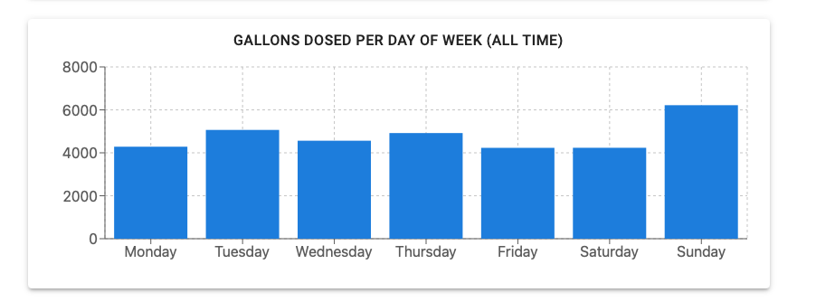
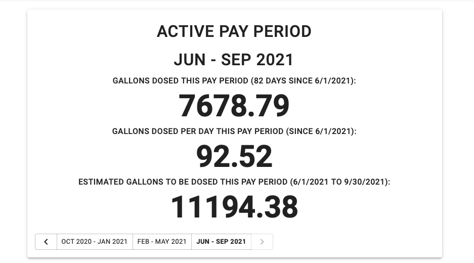
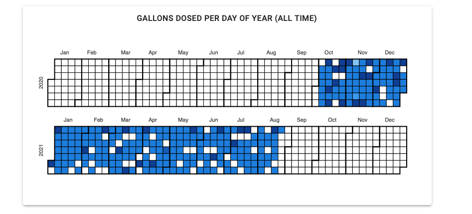
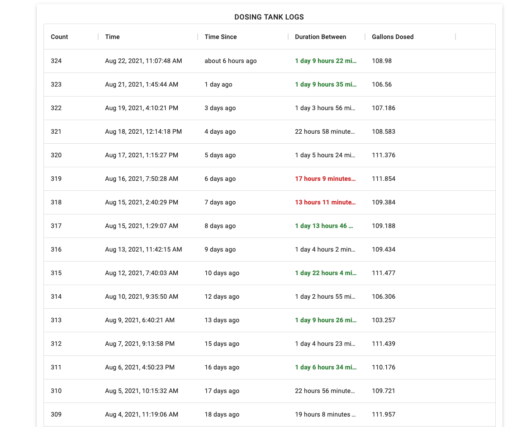

# Home DAS

`home_das` is a rasberry pi based data acquisition system (DAS). This version focuses on monitoring and visualization of usage of a dosing tank pump.

## Data Collection

Data is collected via a [Pi-Plates DAQC2plate](https://pi-plates.com/daqc2r1/) connected to a [Raspberry Pi Model 4 B w/2GB of RAM](https://www.raspberrypi.org/products/raspberry-pi-4-model-b/).

In practice the max data rate of one channel of the DAQC2 is ~1000hz. With all 8 channels collecting, the data rate is ~250hz. It is possible to tweak the [pi-plates DAQC2 python lib](https://github.com/pi-plates/PYTHONmodules/blob/master/DAQC2plate.py) to increase the data rate, but this increases the chance that a data sample is garbage. For this application, the stock software is stable and the data rate is good enough. Looking further, [these lines](https://github.com/pi-plates/PYTHONmodules/blob/master/DAQC2plate.py#L226-L309) may offer insight into higher data rates and less cpu usage, although those data rates are high for the current use case.

## Sensors

## Setup

## UI Features

### Pay Period Usage Statistics

### Total Usage by Weekday

### Usage by Calendar Day

### Usage Logs

## UI Stack:

React based with nextjs backend

Files are is `dashboard/pages`

UI is run with `systemd`. Service is called `home_das_server`. Pages can be reloaded with `sudo service restart home_das_server`. `systemd` config file is in `/lib/systemd/system/home_das_server.service`

### UI Server Structure

# `nextjs` server is run on port 8000. `nginx` is used as a proxy and serves port 80 and static files from the nextjs server. `nginx` config lives in `/etc/sites-enabled/home_das_server.com.conf`
